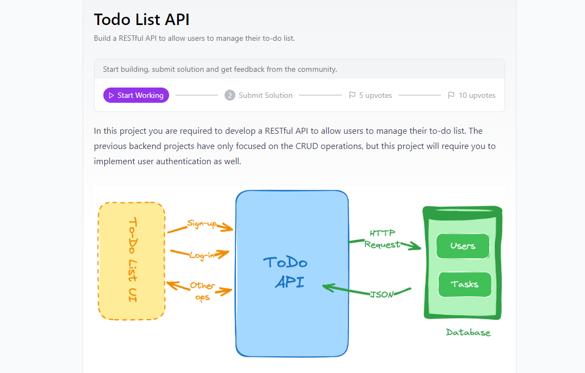

# To-Do List API

Este es un proyecto de API RESTful para gestionar una lista de tareas pendientes (To-Do List), que incluye autenticación de usuarios, operaciones CRUD, paginación y filtrado.

<p align="center">
  
</p>

## Reto
Para más información sobre el reto, visita el siguiente enlace: [Todo List API Challenge](https://roadmap.sh/projects/todo-list-api)

## Características

- Autenticación de usuarios (Registro e Inicio de Sesión con JWT)
- Operaciones CRUD para gestionar tareas
- Paginación y filtrado para la lista de tareas
- Seguridad mediante JWT (JSON Web Token)

## Tecnologías

- **Java 11+**: Lenguaje de programación principal para la lógica de la aplicación.
- **Spring Boot**: Framework para la creación rápida y eficiente de aplicaciones backend.
- **Spring Security**: Gestión de la autenticación y autorización de usuarios.
- **JWT (JSON Web Tokens)**: Sistema de autenticación basado en tokens para manejar sesiones sin estado (stateless).
- **MongoDB**: Base de datos NoSQL utilizada para almacenar usuarios y tareas.
- **Spring Data MongoDB**: Abstracción para interactuar con MongoDB desde Java.
- **Maven**: Herramienta de construcción y gestión de dependencias.
- **Postman**: Cliente API sugerido para probar los endpoints de la API.

## Instalación

1. Clona el repositorio:
    ```bash
    git clone https://github.com/tu_usuario/todo-list-api.git
    cd todo-list-api
    ```

2. Instala las dependencias y compila el proyecto con Maven:
    ```bash
    mvn clean install
    ```

3. Configura MongoDB (asegúrate de que tu base de datos MongoDB esté corriendo).

4. Ejecuta la aplicación:
    ```bash
    mvn spring-boot:run
    ```

## Endpoints

### Autenticación

#### 1. Registro de Usuario

- **URL**: `/auth/register`
- **Método**: `POST`
- **Descripción**: Registra un nuevo usuario.
- **Body**:
    ```json
    {
      "name": "John Doe",
      "email": "john@doe.com",
      "password": "password123"
    }
    ```

- **Respuesta** (201):
    ```json
    {
      "token": "eyJhbGciOiJIUzI1NiIsInR5cCI6IkpXVCJ9..."
    }
    ```

#### 2. Inicio de Sesión

- **URL**: `/auth/login`
- **Método**: `POST`
- **Descripción**: Inicia sesión y genera un token JWT.
- **Body**:
    ```json
    {
      "email": "john@doe.com",
      "password": "password123"
    }
    ```

- **Respuesta** (200):
    ```json
    {
      "token": "eyJhbGciOiJIUzI1NiIsInR5cCI6IkpXVCJ9..."
    }
    ```

### Tareas (To-Do)

#### 3. Crear una Nueva Tarea

- **URL**: `/api/todos`
- **Método**: `POST`
- **Descripción**: Crea una nueva tarea para el usuario autenticado.
- **Encabezado**:
    ```plaintext
    Authorization: Bearer <TOKEN>
    ```
- **Body**:
    ```json
    {
      "title": "Comprar alimentos",
      "description": "Leche, huevos, y pan"
    }
    ```

- **Respuesta** (201):
    ```json
    {
      "id": "64efb0c47c08467dc8b7be72",
      "title": "Comprar alimentos",
      "description": "Leche, huevos, y pan",
      "completed": false,
      "userId": "64efb0a97c08467dc8b7be71"
    }
    ```

#### 4. Obtener Todas las Tareas (con Paginación y Filtrado)

- **URL**: `/api/todos`
- **Método**: `GET`
- **Descripción**: Devuelve todas las tareas del usuario autenticado, con soporte para paginación y filtrado opcional por título y estado.
- **Encabezado**:
    ```plaintext
    Authorization: Bearer <TOKEN>
    ```
- **Parámetros** (opcional):
    - `page` (número de página, predeterminado: `0`)
    - `limit` (límite de tareas por página, predeterminado: `10`)
    - `title` (filtrar por título de la tarea)
    - `completed` (filtrar por estado de la tarea: `true` o `false`)

- **Ejemplo de Solicitud**:
    ```
    /api/todos?page=0&limit=5&completed=false
    ```

- **Respuesta** (200):
    ```json
    [
      {
        "id": "64efb0c47c08467dc8b7be72",
        "title": "Comprar alimentos",
        "description": "Leche, huevos, y pan",
        "completed": false,
        "userId": "64efb0a97c08467dc8b7be71"
      }
    ]
    ```

#### 5. Obtener una Tarea por ID

- **URL**: `/api/todos/{id}`
- **Método**: `GET`
- **Descripción**: Devuelve los detalles de una tarea específica por su ID.
- **Encabezado**:
    ```plaintext
    Authorization: Bearer <TOKEN>
    ```

- **Ejemplo de URL**: `/api/todos/64efb0c47c08467dc8b7be72`

- **Respuesta** (200):
    ```json
    {
      "id": "64efb0c47c08467dc8b7be72",
      "title": "Comprar alimentos",
      "description": "Leche, huevos, y pan",
      "completed": false,
      "userId": "64efb0a97c08467dc8b7be71"
    }
    ```

#### 6. Actualizar una Tarea

- **URL**: `/api/todos/{id}`
- **Método**: `PUT`
- **Descripción**: Actualiza los detalles de una tarea existente.
- **Encabezado**:
    ```plaintext
    Authorization: Bearer <TOKEN>
    ```

- **Body**:
    ```json
    {
      "title": "Comprar alimentos",
      "description": "Leche, huevos, pan y queso",
      "completed": true
    }
    ```

- **Ejemplo de URL**: `/api/todos/64efb0c47c08467dc8b7be72`

- **Respuesta** (200):
    ```json
    {
      "id": "64efb0c47c08467dc8b7be72",
      "title": "Comprar alimentos",
      "description": "Leche, huevos, pan y queso",
      "completed": true,
      "userId": "64efb0a97c08467dc8b7be71"
    }
    ```

#### 7. Eliminar una Tarea

- **URL**: `/api/todos/{id}`
- **Método**: `DELETE`
- **Descripción**: Elimina una tarea existente.
- **Encabezado**:
    ```plaintext
    Authorization: Bearer <TOKEN>
    ```

- **Ejemplo de URL**: `/api/todos/64efb0c47c08467dc8b7be72`

- **Respuesta** (204 No Content):
    ```json
    {
      "status": 204
    }
    ```

## Autenticación

El sistema utiliza **JWT (JSON Web Tokens)** para autenticar a los usuarios. Después de iniciar sesión o registrarse, se te devolverá un token JWT, que debes incluir en el encabezado de autorización para todas las solicitudes a los endpoints protegidos (tareas).

### Ejemplo de Encabezado de Autorización

```plaintext
Authorization: Bearer <TOKEN>
