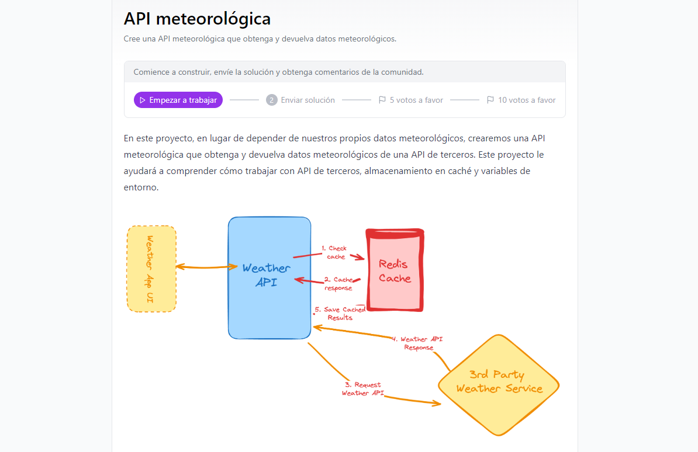

# WeatherAPI 

Una API REST que obtiene y devuelve datos meteorológicos para una ciudad específica, utilizando la API de terceros **Visual Crossing**. La API incluye características como almacenamiento en caché mediante Redis y limitación de velocidad (rate limiting) para evitar el abuso del sistema.

<p align="center">
  
</p>

## Reto
Para más información sobre el reto, visita el siguiente enlace: [Expense Weather API Challenge](https://roadmap.sh/projects/weather-api-wrapper-service)

## Características principales:

- **Obtención de datos meteorológicos en tiempo real**: La API se conecta a la API de Visual Crossing para obtener los datos meteorológicos de una ciudad proporcionada por el usuario.
- **Almacenamiento en caché**: Se utiliza **Redis** para almacenar en caché los resultados meteorológicos, con un tiempo de expiración configurable para optimizar el rendimiento y reducir las solicitudes innecesarias a la API de terceros.
- **Limitación de velocidad (Rate Limiting)**: Implementada con Redis para restringir el número de solicitudes que un usuario puede hacer dentro de un período de tiempo.
- **Gestión de errores**: Manejo adecuado de errores si la API de terceros falla o si se excede el límite de solicitudes.

## Tecnologías utilizadas:
- **Java JDK 21:** Lenguaje de programación principal.
- **Spring Boot:** Framework para crear aplicaciones web rápidas y eficientes.
- **Spring Data Redis:** Para la integración con Redis y manejo del almacenamiento en caché y limitación de velocidad.
- **Redis:** Usado para almacenar en caché los datos meteorológicos y gestionar la limitación de velocidad.
- **Docker y Docker Compose:** Utilizados para ejecutar Redis de manera rápida y sencilla.
- **Visual Crossing API:** API de terceros para obtener los datos meteorológicos.
- **Maven:** Para la gestión de dependencias y construcción del proyecto.
- **Lombok:** Para simplificación de clases Java mediante la generación automática de getters y setters.
- **Jackson:** Para la serialización y deserialización de JSON.

## Instalación y configuración:

### Prerrequisitos:

- **Java JDK 21**
- **Maven** (para gestionar dependencias y construir el proyecto)
- **Docker y Docker Compose** (para levantar Redis)
- Clave API de Visual Crossing (puedes obtener una en [Visual Crossing](https://www.visualcrossing.com/))

### Clonar el repositorio:

```bash
git clone <URL-de-tu-repositorio>
cd Beg09WeatherAPI
```
### Variables de entorno:

Crea un archivo .env en el directorio raíz del proyecto y agrega la clave API de Visual Crossing:
```
SPRING_API_WEATHER_KEY=tu_visual_crossing_api_key
```
### Configuración de Redis con Docker Compose:

Este proyecto incluye un archivo `docker-compose.yml` para levantar Redis fácilmente usando Docker Compose. Para iniciar Redis, simplemente ejecuta:

```
docker-compose up -d
```

Esto iniciará Redis en el puerto predeterminado 6379, que está configurado en el archivo `application.properties`:

```
spring.redis.host=localhost
spring.redis.port=6379
```

Si necesitas cambiar la configuración, puedes modificar el archivo `.env` o `application.properties`.

## Construir el proyecto:
Compila el proyecto usando Maven:

```
mvn clean install
```

## Ejecutar la aplicación:
Una vez que Redis esté en ejecución (a través de Docker Compose), puedes iniciar la aplicación:

```
mvn spring-boot:run
```
La API estará disponible en `http://localhost:8080`.

## Endpoints:
### Obtener datos meteorológicos para una ciudad:
- **Descripción:** Obtiene los datos meteorológicos actuales para una ciudad específica.

- **URL:** `/weather/{city}`

- **Método:** `GET`

- **Parámetros:**

  - **city:** El nombre de la ciudad para la que deseas obtener los datos meteorológicos.
  Ejemplo de solicitud:

- **Ejemplo de solicitud:**
```
GET http://localhost:8080/weather/lima

```

- **Ejemplo de respuesta:**

```bash
{
    "queryCost": 1,
    "latitude": -12.0464,
    "longitude": -77.0428,
    "resolvedAddress": "Lima, Lima, Peru",
    "timezone": "America/Lima",
    "currentConditions": {
        "datetime": "2024-09-21T03:00:00",
        "temp": 61.0,
        "feelslike": 61.0,
        "humidity": 84.0,
        "precip": 0.0,
        "conditions": "Partially cloudy",
        "windgust": 0.0,
        "windspeed": 5.0,
        "winddir": 180.0,
        "pressure": 1015.0,
        "visibility": 10.0,
        "cloudcover": 70.0
    }
}

```
### Gestión de errores:
- Si el límite de solicitudes es superado, la API devuelve un estado `429 Too Many Requests` con un mensaje de error.
- Si el nombre de la ciudad no es válido o no se encuentran datos, la API devuelve un estado `404 Not Found`.

## Caché y limitación de velocidad:
- Caché: Los resultados de la API se almacenan en Redis con una duración de 12 horas. Si se realiza una solicitud para una ciudad que ya ha sido solicitada dentro de ese período, los datos se devuelven desde la caché.
- Limitación de velocidad: Cada usuario (identificado por su IP) está limitado a un máximo de 100 solicitudes por minuto. Si se excede ese límite, la API devolverá un error `429 Too Many Requests`.

## Dependencias:
El proyecto utiliza las siguientes dependencias principales:

- **Spring Boot:** Framework principal de la aplicación.
- **Spring Data Redis:** Para integración con Redis.
- **Jackson:** Para serialización y deserialización de JSON.
- **Lombok:** Para simplificación de clases (getters/setters).
- **Spring Web:** Para crear la API REST.


