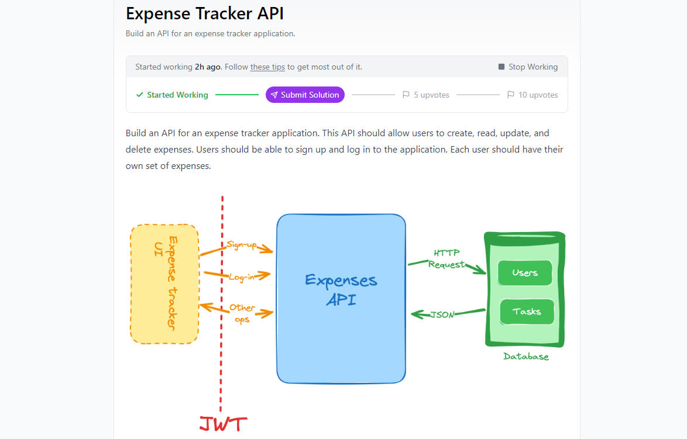

# Sistema de Gestión de Gastos

Este es un sistema de gestión de gastos que permite a los usuarios registrar, organizar y visualizar sus gastos. La aplicación incluye roles diferenciados para **usuarios** y **administradores**, y utiliza **JWT** para autenticar a los usuarios y autorizar sus acciones.

# Sistema de Gestión de Gastos

<p align="center">
  
</p>

## Tecnologías Utilizadas

- **Java 11+**: Lenguaje de programación principal para la lógica de la aplicación.
- **Spring Boot**: Framework para crear la aplicación de backend de manera rápida y eficiente.
- **Spring Security**: Para la gestión de la autenticación y autorización de usuarios.
- **JWT (JSON Web Tokens)**: Mecanismo de autenticación basado en tokens para sesiones sin estado (stateless).
- **JPA/Hibernate**: ORM utilizado para la interacción con la base de datos.
- **PostgreSQL**: Base de datos relacional utilizada para almacenar usuarios, categorías y gastos.
- **Maven**: Herramienta para la gestión de dependencias y la construcción del proyecto.
- **Postman**: Cliente API sugerido para probar los endpoints de la aplicación.

## Características Principales

### 1. Autenticación y Autorización

- **Autenticación mediante JWT**: Los usuarios se registran e inician sesión para obtener un token JWT, que se utiliza para autenticar todas las solicitudes posteriores.
- **Roles**:
    - `ADMIN`: Tiene permisos para gestionar categorías globales y eliminar usuarios.
    - `USER`: Solo puede gestionar sus propias categorías personalizadas y gastos.

### 2. Gestión de Categorías

- **Usuarios (USER)**:
    - Pueden crear, actualizar y eliminar **categorías personalizadas**.
    - Solo pueden eliminar categorías si no tienen gastos asociados.
- **Administradores (ADMIN)**:
    - Pueden crear, actualizar y eliminar **categorías globales** que son visibles para todos los usuarios.
    - No pueden eliminar una categoría si hay gastos asociados a ella.

### 3. Gestión de Gastos

- **Usuarios (USER)** pueden:
    - Crear, actualizar y eliminar **sus propios gastos**.
    - Asociar gastos a categorías globales o personalizadas.
    - Filtrar gastos por categoría o por fechas.
    - No pueden ver ni gestionar los gastos de otros usuarios.

### 4. Gestión de Usuarios (Solo para Administradores)

- **Administradores (ADMIN)** pueden:
    - Eliminar usuarios del sistema.
    - Al eliminar un usuario, se eliminan todas sus categorías personalizadas y gastos.

---

## Flujos de Trabajo

### Autenticación

1. **Registro de usuarios**: Los usuarios pueden registrarse en `/auth/signup`.
2. **Inicio de sesión**: Los usuarios obtienen un **JWT** en `/auth/login`.
3. **Acceso protegido**: Todas las peticiones posteriores deben incluir el token JWT en el encabezado de la solicitud: `Authorization: Bearer <token>`.

### Gestión de Categorías

- **Usuarios** pueden:
    - Crear, actualizar y eliminar **categorías personalizadas** usando los endpoints:
        - `POST /api/categories/createCustom`
        - `PUT /api/categories/{id}`
        - `DELETE /api/categories/{id}` (Solo si no hay gastos asociados)

- **Administradores** pueden:
    - Crear, actualizar y eliminar **categorías globales** usando los endpoints:
        - `POST /api/categories/createGlobal`
        - `PUT /api/categories/{id}`
        - `DELETE /api/categories/{id}` (Solo si no hay gastos asociados)

### Gestión de Gastos

1. **Usuarios** pueden:
    - Crear, actualizar y eliminar **sus propios gastos** en:
        - `POST /api/expenses`
        - `PUT /api/expenses/{id}`
        - `DELETE /api/expenses/{id}`
    - Asociar gastos a **categorías globales o personalizadas**.

### Gestión de Usuarios (Administradores)

- **Administradores** pueden:
    - Eliminar usuarios del sistema en:
        - `DELETE /api/users/{id}`

---

## Endpoints

### Autenticación

- `POST /auth/signup`: Registrar un nuevo usuario.
- `POST /auth/login`: Iniciar sesión y obtener un **JWT**.

### Categorías

- `POST /api/categories/createGlobal`: Crear una categoría global (ADMIN).
- `POST /api/categories/createCustom`: Crear una categoría personalizada (USER).
- `PUT /api/categories/{id}`: Actualizar una categoría (ADMIN/USER).
- `DELETE /api/categories/{id}`: Eliminar una categoría (ADMIN/USER).

### Gastos

- `POST /api/expenses`: Crear un nuevo gasto (USER).
- `PUT /api/expenses/{id}`: Actualizar un gasto (USER).
- `DELETE /api/expenses/{id}`: Eliminar un gasto (USER).

### Usuarios

- `DELETE /api/users/{id}`: Eliminar un usuario (ADMIN).

---

## Seguridad y Roles

- **ADMIN**:
    - Crear, actualizar y eliminar **categorías globales**.
    - Eliminar usuarios.
    - Administrar recursos globales y de todos los usuarios.

- **USER**:
    - Crear, actualizar y eliminar **categorías personalizadas**.
    - Crear, actualizar y eliminar **sus propios gastos**.
    - No pueden ver o modificar los recursos de otros usuarios.

---

## Instalación y Ejecución

### Requisitos Previos

- **Java 11+**
- **Maven 3.6+**
- **MySQL** o cualquier base de datos compatible con JPA.
- **Postman** o cualquier cliente de API para probar los endpoints.

### Pasos de Instalación

1. Clona el repositorio:
   ```bash
   git clone https://github.com/tu-repo.git
    ```
2. Configura la base de datos en el archivo application.properties:
   ```bash
    #hibernate
    spring.jpa.properties.hibernate.dialect=org.hibernate.dialect.PostgreSQLDialect
    spring.jpa.hibernate.ddl-auto=update
    
    spring.config.import=optional:file:.env[.properties]
    
    #DATABASE CONFIGURATION
    spring.datasource.url=${SPRING_DATASOURCE_URL}
    spring.datasource.username=${SPRING_DATASOURCE_USERNAME}
    spring.datasource.password=${SPRING_DATASOURCE_PASSWORD}
    spring.datasource.driver-class-name=com.mysql.cj.jdbc.Driver
    spring.jpa.show-sql= true
    
    #SECURITY CONFIG
    security.jwt.key.private = ${SPRING_JWT_KEY_PRIVATE}
    security.jwt.user.generator=${SPRING_JWT_USER_GENERATOR}
    ```

### Pruebas
Usa Postman o cualquier cliente HTTP para probar los endpoints de la API.