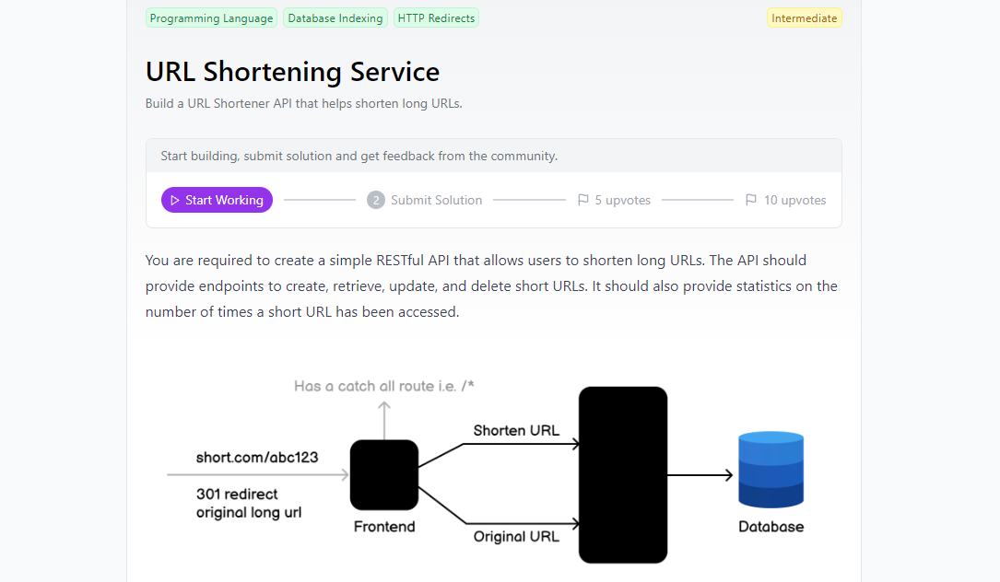

# URL Shortener API

Este proyecto es una API RESTful desarrollada con Spring Boot, que permite acortar URLs largas, redirigir a las URLs originales y proporcionar estadísticas sobre cuántas veces se ha accedido a cada URL corta. La API integra Redis para dos funciones principales: almacenamiento en caché de las URLs acortadas y manejo eficiente del conteo de accesos. Además, se utiliza PostgreSQL como base de datos relacional para el almacenamiento persistente de los datos.

## Implementación con un FrontEnd
Se implementó con un FrontEnd desarrollado en React.js para que de esta forma se pruebe la funcionalidad de todos los endpoints que ofrece el Backend.
- Código Front : [URL Shortener Frontend](https://github.com/RendevMq/UrlShortenerFront)
- Demo

https://github.com/user-attachments/assets/b731e88e-9776-4270-9911-ef4323c2c4b3

## Reto
Para más información sobre el reto, visita el siguiente enlace: [URL Shortening Service Challenge](https://roadmap.sh/projects/url-shortening-service)

<p align="center">
  
</p>

## Características principales
- Crear una URL corta a partir de una URL larga.
- Redirigir a la URL original utilizando la URL corta.
- Obtener estadísticas sobre cuántas veces se ha accedido a la URL corta.
- Eliminar URLs cortas y sus contadores de accesos.
- Cachear y gestionar el contador de accesos

## Tecnologías utilizadas
- **Java 17**
- **Spring Boot 3.x**
- **Spring Data JPA** (para la interacción con PostgreSQL)
- **PostgreSQL** (base de datos relacional)
- **Redis** (para cachear y gestionar el contador de accesos)
- **Lombok** (para reducir código repetitivo)
- **Maven** (para la gestión de dependencias)
- **Docker Compose** (para ejecutar PostgreSQL y Redis con Docker)

## Requisitos previos

### Instalación de herramientas
- **Java 17** o superior.
- **Maven** (para la construcción y ejecución del proyecto).
- **PostgreSQL** (versión 13 o superior).
- **Redis** (en ejecución en el puerto 6379).

### Configuración de la base de datos (PostgreSQL)
1. Instala PostgreSQL y crea una base de datos para este proyecto:
   ```sql
   CREATE DATABASE url_shortener_db;
    ```
2. Asegúrate de configurar las credenciales de acceso en el archivo **application.properties**:
   ```sql
    #hibernate
    spring.jpa.properties.hibernate.dialect=org.hibernate.dialect.PostgreSQLDialect
    spring.jpa.hibernate.ddl-auto=create-drop
    
    spring.config.import=optional:file:.env[.properties]
    
    #DATABASE CONFIGURATION
    spring.datasource.url=${SPRING_DATASOURCE_URL}
    spring.datasource.username=${SPRING_DATASOURCE_USERNAME}
    spring.datasource.password=${SPRING_DATASOURCE_PASSWORD}
    spring.jpa.show-sql= true
    
    #SECURITY CONFIG
    security.jwt.key.private = ${SPRING_JWT_KEY_PRIVATE}
    security.jwt.user.generator=${SPRING_JWT_USER_GENERATOR}
    ```
## Endpoints

1. Crear una URL corta
    - **Método:** `POST`
    - **URL:** `/shorten`
    - **Body:**
    ```json
   {
       "originalUrl": "https://www.example.com"
    }
   ```
    - **Respuesta exitosa:**
    ```json
    {
        "originalUrl": "https://www.example.com",
        "shortCode": "abc123",
        "shortUrl": "http://localhost:8080/abc123",
        "createdAt": "2024-09-26 15:30:00"
    }
   ```
2. Redirigir a la URL original
    - **Método:** `GET`
    - **URL:** `/shorten/{shortCode}`
   
    Si el código corto es válido, se redirigirá a la URL original.

    Respuesta exitosa: `301 Moved Permanently.`


3. Obtener estadísticas de una URL corta
    - **Método:** `GET`
    - **URL:** `/shorten/{shortCode}/stats`
    ```json
    {
        "shortCode": "abc123",
        "accessCount": 10,
        "originalUrl": "https://www.example.com",
        "createdAt": "2024-09-26 15:30:00"
    }
   ```

4. Eliminar una URL corta
    - **Método:** `DELETE`
    - **URL:** `/shorten/{shortCode}`
   
    Respuesta exitosa: 204 No Content

## Pruebas
Usa Postman o cualquier cliente HTTP para probar los endpoints de la API.


