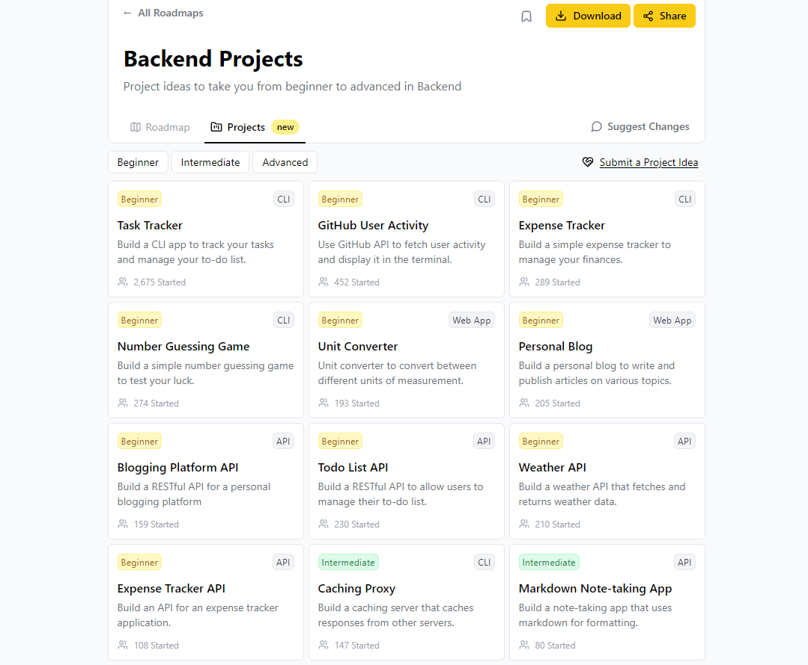

# Reto Backend Java ♨️ - Proyectos de Roadmap.sh

Este repositorio contiene la implementación de diversos proyectos y retos propuestos por [roadmap.sh](https://roadmap.sh/backend/projects). **La idea es ir completando progresivamente cada uno de los proyectos, desde los niveles más básicos hasta llegar a los proyectos avanzados.** El objetivo es proporcionar soluciones a problemas reales y desafíos del desarrollo backend, utilizando una amplia variedad de tecnologías y aplicando buenas prácticas de desarrollo. 

  

## 🚀Tecnologías Utilizadas

Este repositorio incluye soluciones basadas en las siguientes tecnologías:

- **Java 11+**: Lenguaje de programación principal para la lógica de la aplicación.
- **Spring Boot 2.6+**: Framework para la creación rápida y eficiente de aplicaciones backend.
- **Spring Security**: Para la gestión de la autenticación y autorización de usuarios.
- **JWT (JSON Web Tokens)**: Mecanismo de autenticación basado en tokens para manejar sesiones sin estado (stateless).
- **JPA/Hibernate**: ORM utilizado para la interacción con bases de datos relacionales.
- **Spring Data JPA**: Abstracción de Spring para trabajar con bases de datos relacionales.
- **MongoDB**: Base de datos NoSQL utilizada para almacenar información de usuarios y tareas.
- **Spring Data MongoDB**: Abstracción para interactuar con MongoDB desde Java.
- **PostgreSQL**: Base de datos relacional utilizada para gestionar datos persistentes.
- **MySQL**: Otra base de datos relacional utilizada en algunos proyectos.
- **Redis**: Para almacenamiento en caché y limitación de velocidad.
- **Docker**: Para contenerización de las aplicaciones y facilitar su despliegue.
- **Maven**: Herramienta para la gestión de dependencias y la construcción del proyecto.
- **Postman**: Cliente API sugerido para probar los endpoints de la aplicación.

## ⌨️ Proyectos de Backend con Java

Proyectos completados hasta el momento. A medida que avance, iré añadiendo más retos y soluciones. ツ

| Número | Proyecto | Código |
| --- | --- | --- |
| `07` | Blogging Platform API | [Ver](https://github.com/RendevMq/Backend-Projects-Java/tree/main/Beg07BloggingPlatformAPI) |
| `08` | To-Do List API | [Ver](https://github.com/RendevMq/Backend-Projects-Java/tree/main/Beg08TodoListAPI) |
| `09` | Weather API | [Ver](https://github.com/RendevMq/Backend-Projects-Java/tree/main/Beg09WeatherAPI) |
| `10` | Expense Tracker API | [Ver](https://github.com/RendevMq/Backend-Projects-Java/tree/main/Beg10ExpenseTrackerAPI) |
| `11` | Caching Proxy | [Ver](https://github.com/RendevMq/Backend-Projects-Java/tree/main/Int11CachingProxy) |
| `13` | URL Shortener API | [Ver](https://github.com/RendevMq/Backend-Projects-Java/tree/main/Int13URLShorteningService) |

